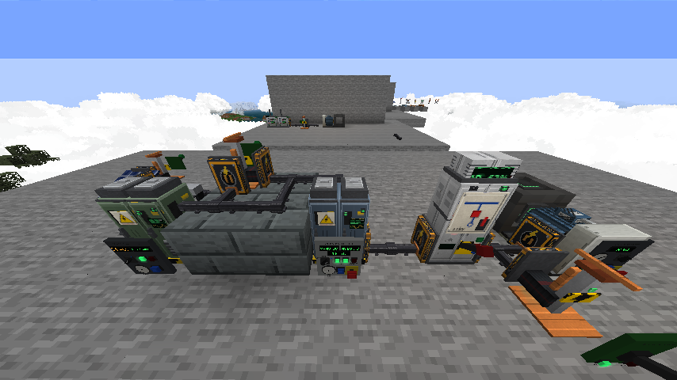
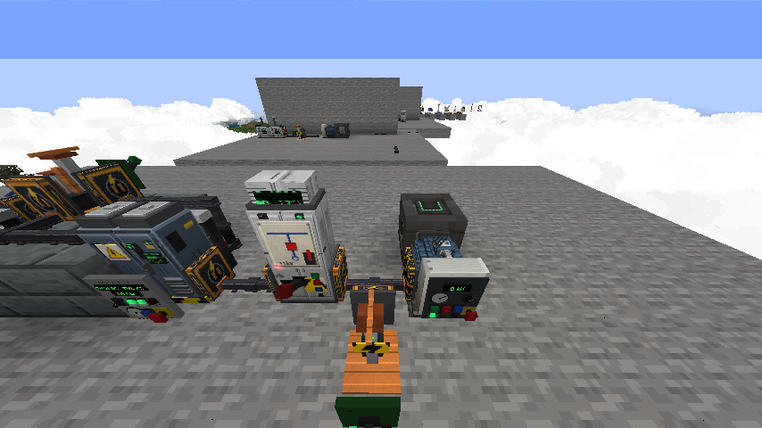

# Immersive Railroading Extras

An add-on for **Immersive Railroading** on Minecraft **1.12.2** (Forge / Cleanroom) that turns a set of tracks into a
railway that runs itself, and powers it with a **real electrical grid**: driverless trains, ticket machines, signalling
with real interlocking, a live control center, 40 Pride Rail trains (monorails, maglevs, subways, high-speed), stations,
industries with supply chains, and a power system where voltage, current, power factor, cable size and short circuits
all actually matter.

> ## ⚠️ Beta / development version (0.6.0-beta)
> This is a **development build** for players who want the newest features and are happy to report bugs.
> - The big new systems (real electricity, control panels, generators, motors) were tested in game on test rigs, but
>   not yet in long survival play.
> - **Textures and models are not final yet.** They are being reviewed and polished by hand; expect visual changes.
> - Back up your world before updating. Old power grids keep working (see *Upgrading*).
> - Bug reports, crash logs and screenshots are very welcome: please open an issue.



---

## The Pride Rail power grid (new in 0.6.0)

Electricity is not one "power" number here. Every network has a **voltage level**, and every piece of the grid behaves
like the real thing.

### Real electrical properties
- **Voltage levels:** 12 / 24 / 48 V DC, 120 / 240 V AC, 208 / 480 V three-phase, 4.16 kV, 13.8 kV and 69 kV, plus the
  railway systems: 600 / 750 / 1500 / 3000 V DC and 25 kV 50 Hz overhead.
- Each network is solved once a second: real power **P**, reactive power **Q**, apparent power **S**, **power factor**,
  current in amps, **I²R losses**, **voltage drop** along every cable, efficiency, and **conductor temperature**.
- Losses are real energy taken from the grid. Run 22 kW at 48 V and you pull ~460 A: a thin cable heats up, its
  insulation fails and it **burns out** (fire included). Step the voltage up and the same power needs a fraction of the current.
- **Prospective short-circuit current** for every network (utility fault level, generator subtransient reactance,
  transformer impedance, inverters current-limited).

### Cables you choose
Sneak + right-click the air with a Power Cable to pick the conductor:
- **Copper or aluminium** in standard sizes from 1 mm² to 300 mm², or **superconductor** (zero resistance).
- **Cores:** single core, 2-core DC, 3-phase + N + PE, screened motor cable, or a copper **busbar**.
- **Insulation class:** LV 1 kV, MV 15 kV or HV 72.5 kV. A cable on a voltage above its class **flashes over**.
- Each cable looks different (LV / MV / HV / superconductor / busbar jackets, thin / medium / thick) and reports its
  spec, current, rating and temperature when clicked.

### Converting power
| Machine | Does | Notes |
|---|---|---|
| Power Transformer | AC → AC (any two levels) | On-load tap changer (±10 %), AVR, cooling fans, winding temperature; off-circuit tap links set with a screwdriver |
| Traction Transformer | → 25 kV 50 Hz | Overhead contact wire |
| Traction Rectifier | AC → DC (600 / 750 / 1500 / 3000 V) | DC breaker, overvoltage trip |
| **Inverter** | DC → AC | 120 / 208 / 240 / 480 V out; RUN switch, e-stop, trips at 150 % load |
| **DC-DC Converter** | DC → DC | e.g. 48 V battery → 750 V third rail |

Converters have real sides: the **back is the input** (primary), the other faces are the output network. Feed one the
wrong kind of power (AC into an inverter, DC into a transformer) and it refuses with a fault.

### Generators that really spin
- Diesel generators and steam turbines **run up to speed** over a few seconds; output frequency follows the shaft.
- A **synchroscope** and a **sync-check relay**: you can only close a generator onto a live grid when it is in step.
  Trim the speed with the governor buttons until the pointer creeps to 12 o'clock, or let AUTO synchronise for you.
- Protection: **under-frequency**, **overload** and **reverse-power** trips. An overloaded generator on its own slows
  down, its frequency sags and it trips, which can cascade into a blackout.
- Solar arrays (AC or 48 V DC) and wind turbines.

### Motors that drive any mod's machines
- **Electric Motor** (three-phase induction, with its starter): its shaft (the back) powers any Forge Energy machine
  from any mod.
- Starters: **direct on line** (~6.5x inrush), **star-delta**, **soft starter**, or **VFD** (also runs from DC or
  single phase). Inrush dips the voltage; a weak supply stalls the start. Thermal overload trips on low voltage.
- HAND / OFF / AUTO selector (AUTO = redstone runs it).

### Protection and safety
- **Circuit breakers** with a big operating handle that swings, closing spring, LOCAL / REMOTE key, protection relay,
  and a **breaking capacity** (10 / 25 / 40 / 63 kA). Faults trip the nearest breaker upstream (selective protection);
  if the fault current is bigger than its rating, the breaker fails violently.
- Earthing switches, surge arresters, disconnectors, capacitor banks (automatic power-factor correction).
- **Lockout padlock + danger tag:** lock equipment in its safe state; nothing can switch it back until the person who
  hung the padlock removes it.
- **Electrician's screwdriver:** opens any machine's settings; adjusts transformer tap links, but only when dead (try
  it live and you get zapped).
- **Unit Substation Kit:** one click builds a complete 13.8 kV → 480 V substation.

### Control panels, meters and instruments

- Every grid machine has a **real control panel** with only the controls its real-world counterpart has: push buttons,
  lamps, selector and key switches, e-stops, digital displays and gauges, all clickable and live.
- **Control-room instruments** you hang on a wall and link with the Signal Wrench: voltmeter, ammeter, wattmeter,
  var meter, power-factor meter, frequency meter, thermometer, a readout screen and a status lamp. Needles ease to the reading.
- **Multimeter / clamp meter:** right-click any machine or cable for V, A, Hz, P, Q, S, PF, losses, efficiency,
  temperature and the prospective fault current.
- **Smart energy meter:** real power, kWh, peak demand, PF, volts and amps.
- Cables never plug into a control panel: they enter through the back, sides, top or bottom like real cable glands.

---

## Pride Rail trains (new in 0.6.0)
- **40 trains** (smooth and voxel styles) with cab and passenger cars: Las Vegas, Seattle, Tokyo, Innovia and Chongqing monorails; Transrapid,
  L0 and 6 more maglevs; N700S, ICE 3, GG1 and other high-speed and electric trains; NYC R211 / R160, London 2009
  Tube Stock / S Stock, Tokyo Ginza 1000 and Paris MP14 subways.
- Real / Pride / Trans liveries, smooth meshes plus a voxel style set, detailed bogies, underfloor equipment and couplers.
- Interiors you can walk through: seats, poles, racks, toilets, wheelchair bays, a cab with working controls, walk-through
  gangways with doors that open as you approach, live LED destination boards and passenger screens.
- Whole-train items and `/irextras consist <set>` place a coupled train in one go.
- Monorail beams, maglev guideways (as live power rails) and Pride third rail track; a redesigned overhead line
  (masts, cantilevers, contact and messenger wire, portal girders).
- Automatic platform-side **train doors** and platform screen doors (Station Door Controller).

## Running a railway (new in 0.6.0)
- **Orders and profit** (OpenTTD style): per-stop orders (stop, full load, unload, load only, go via, wait) shared by
  every train on a line.
- **Railway Control Center:** tabs for the map, a live trains table, lines and orders, stations, signals, power and maintenance.
- **Maintenance and wear:** odometer, wheel / brake / engine / bearing / electrics wear, alerts and a Maintenance Depot.
- **Stations:** 12 pieces in 4 styles (Victorian, Modern, Metro, Rural Halt) and a Station Master's Desk; rural halts
  are request stops.
- **Industries with supply chains:** mines, quarry, logging camp and farm feed a sawmill, steel mill, flour mill and
  cement works, which supply a town market; a coal power station feeds the grid.
- **Signal box programming:** WHEN / THEN / ELSE rules, 64 wireless channels, an alarm log, a Redstone Interface with
  Project Red bundled cables, a programmable Signalling Control Desk and an **NX route-setting desk** with a lit mimic diagram.
- **Settings Console:** every block has an options screen (sneak + right-click with the Signal Wrench): crossings,
  detectors, terminals, arrivals boards, depots, substations, signal masts, track circuits, ticket machines and more.

---

## Everything from earlier versions

#### Driverless trains
Click any locomotive on the Dispatcher Board → **Make driverless…**
- **Line** — loops through a list of stations. **Shuttle** — end to end and back. **On call** —
  waits at home until a ticket calls it. **Send** — one trip to one station.
- Finds its own way along the real track: every junction is tried both ways, forward or
  reverse, so it can back out of a terminus.
- Locks and throws the switches ahead of it (never under another train, never against
  another route), clears CTC signals it owns, and drops them behind it.
- Reads the signals and speed signs facing it and brakes on a proper braking curve — stops
  short of red, slows for yellow, obeys posted limits.
- Drives with the normal throttle, brake and reverser (IR physics still applies), stops at the
  platform, rings the bell, runs IR item/fluid loaders at the station, waits, and whistles off.

#### Tickets & the Ticket Machine
- Two-block-tall station kiosk (Blockbench model). Right-click for a touch screen: pick a
  destination, one way or round trip, pay the fare (configurable item, distance-based).
- Right-click the machine **holding a ticket** from that station: the ticket is punched and the
  dispatcher sends a train — a line train that serves both stations, or the nearest on-call train.
- Link platform signals with the Signal Wrench and they are held at Stop while a train boards.
- Redstone: pulse when a ticket is accepted, steady while a train is boarding.

#### Timetables & planning
- Write a **timetable**: named services on a line, each with a first departure, a repeat headway
  and a call list (arrive/depart offsets). Stored with the world.
- The planner reserves track in **time and space** before anything moves, with a headway pad, so
  two services are never planned nose-to-tail. If a run clashes it pushes the departure later and
  retries instead of failing.
- **Meet planning** on single track: where two opposing services share a stretch, it picks a
  passing place, preferring the middle of the shared run.

#### Build your own gantry tower
The gantry is made of parts, so the tower is yours to design rather than something the mod stamps
out for you:
- **Gantry Tower Leg** — steel lattice, climbable like a ladder.
- **Gantry Walkway** — grating you can stand on.
- **Gantry Handrail** — 1.5 blocks tall in collision (the same trick vanilla fences use) so
  Auto-Jump cannot hop it and drop you off the deck.
- **Gantry Radio Mast** — slim mast with cross elements and a dish. Four facings, stacks for a
  taller mast, decoration only.

#### Signalling
- Six American signal families: color light, searchlight, PRR position light, B&O color
  position light, dwarf, semaphore. Automatic block signalling with 3-block aspects and
  diverging (medium) aspects on multi-head masts.
- Insulated joints, track circuits, relay cases, signal bridges (gantries), grade crossings
  with gates, lineside signs.
- **CTC route setting** (entrance–exit): on the board press *Set route*, click the start signal,
  then the end signal. Switches are lined and locked, the entrance signal clears, and the route
  releases itself after the train passes. Signals can be put in **CTC mode** so they hold Stop
  until a route is set.
- **Interlocking**: a locked switch can't be thrown by hand, by another route, or by another
  driverless train until it is released.

#### Train protection (PTC)
Every train a player drives is watched: approaching a Stop signal or a speed sign too fast
triggers a penalty brake; reaching a Stop signal at speed is an emergency brake. The driver is
told why. Speed limit signs carry a settable mph value.

#### Stations
- **Dispatcher Board** / **Rail Display Panel** wall / handheld **Rail Map**: live map of track,
  switches (click to throw), signals, stations, trains (click for a driving desk), block
  occupancy, timetable.
- **Lines** editor on the board: name a line and click stations in order.
- **Arrivals Board**: amber split-flap style display of the driverless trains due at the
  nearest station; boards placed side by side join into one wide board; chimes on arrival.
- **Defect Detector**: announces every passing train in chat, the way the real ones do —
  *"…milepost 12.4, track 1. No defects. Train speed 42. Total axles 36. Temperature 71 degrees.
  Detector out."*

#### OpenComputers — `component.railroad`
Place a **Railroad Data Link** next to a computer:
```lua
local rr = require("component").railroad
for _, t in ipairs(rr.getTrains()) do print(t.id, t.name, t.speed, t.status) end
rr.getStations()  rr.getLines()  rr.getSignals()
rr.setSwitch(x, y, z, "turn")          -- "straight" | "turn" | "auto"
rr.holdSignal(x, y, z, true)
rr.setRoute(x1, y1, z1, x2, y2, z2)    rr.cancelRoute(x1, y1, z1)
rr.trainCommand(id, "horn")            -- throttle_up, brake_up, forward, emergency_stop, ...
rr.sendTrain(id, "Harbor")
rr.setAutopilot(id, "line", "Blue Line", 60, 20)   -- or "shuttle", "oncall", "off"
rr.ticket("Downtown", "Airport", "Alex")
rr.isProtected(id)
```

---

## Upgrading from 0.5.x
- Old power grids keep working: converters placed before 0.6 stay in **legacy pass-through** mode until you switch
  them to *Real* in their settings, and old cables are 95 mm² copper MV.
- Machines placed before 0.6 keep their panel-face connections; new ones never connect through a control panel.

## Quick start
Keep blocks you place beside the track at least **2 blocks from the track centre** (outside the
train's width): rolling stock knocks out small blocks inside its own width. Insulated joints go on
the ground **beside** the rail, never under it (replacing the block under IR track breaks the track).

1. Place a **Dispatcher Board** near your track and open it.
2. Click a piece of track at each stop → type a station name → Save.
3. **Lines** → New line → name it → click the stations in order → Save line.
4. Click a locomotive → **Make driverless…** → Line → pick the line → Start driverless.
5. Put a **Ticket Machine** and an **Arrivals Board** at a station.


## Commands
- `/irextras status`: everything the mod tracks, plus a track scan from where you stand. Please paste it into bug reports.
- `/irextras wear`, `/irextras list [radius]`, `/irextras despawn [radius]`, `/irextras consist <set>`.

## Requirements
- Minecraft 1.12.2, Forge 14.23.5 or Cleanroom
- Immersive Railroading 1.10+ and **UniversalModCore 1.3.1+**
- Optional: Land of Signals, Dynmap, OpenComputers 1.8.9, Project Red (bundled cables)

## Building
```
./gradlew build
```
Gradle needs a recent JDK (built with Java 25); the mod targets Java 8 bytecode (modern syntax via Jabel). Put the
compile-only jars listed below into `libs/` first. Blockbench sources for the models are in [`blockbench/`](blockbench/),
texture and model generators in [`tools/`](tools/).

## Help wanted
The things most likely to need real-world fixing:
- **Driverless trains** on unusual track (turntables, transfer tables, very tight curves, slopes).
- **Switch detection** — which leg is "turn" vs "straight" across IR versions/forks.
- Route searches through **unloaded chunks** (currently they simply fail).
- Braking tuning for heavy consists and steam locomotives.
- Multiplayer testing of tickets and routes.

Crash logs (`logs/latest.log`) and a description of the track layout help the most.


## License
MIT License, © 2026 crunkazcanbe. Immersive Railroading and UniversalModCore belong to their authors and are not included.

## Credits
Made by crunkazcanbe.

Made with [Claude Code](https://claude.com/claude-code) and [Blockbench](https://www.blockbench.net).

## Compile-only jars

The build compiles against these jars in `libs/` (other authors' mods / APIs). They are not included in this repo; get them from their official pages:

- `Dynmap-3.2.1-forge-1.12.2.jar`
- `ImmersiveRailroading-dev.jar`
- `LandOfSignals-1.12.2-forge-1.4.1.jar`
- `OpenComputers-1.8.9a-api.jar`
- `ProjectRed-api-4.9.4.jar`
- `TrackAPI-1.12.2-forge-1.3.jar`
- `Traincraft-4.4.1-1.12.2-dev.jar`
- `UniversalModCore-1.12.2-forge-1.3.2-a6546e1.jar`
